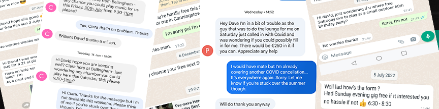

<h1>Late Gigs</h1>

[Live project:](https://late-gigs.herokuapp.com/)

Late Gigs is an online, 'last-minute' booking service for live music in the North East of Ireland.

Recently, almost every live music venue and act across
the region has been affected by a sudden gig cancellation due to the ongoing Covid pandemic.

This command line application has been designed to help venues and artists, create gigs as quickly and efficiently as possible by firstly, searching through a database of available acts and venues to find a suitable match. If no match is found, Late Gigs will store the users information on a Google Spreadsheet then automatically create a gig for the user if a match is found. 

Users can also remove themselves from either of the Google-Sheet waiting lists if they secure an eleventh hour gig by another means.

Utilising Google's Gmail API, Late Gigs notifies both venues and acts on either of the waiting lists by email when a match is made and a gig is created. They are then automatically removed from the waiting lists and placed on a list of confirmed gigs.

## Contents
[Planning & Development](https://github.com/)

[Features](https://github.com/)

[Testing](https://github.com/)

[Deployment](https://github.com/)

[Languages](https://github.com/)

[Software](https://github.com/)

[Media](https://github.com/)

[Credits](https://github.com/)

## Planning & Development

- __Business Strategy__

     Late Gigs was born out of my own personal frustration surrounding the manifold increase in booking cancellations throught the local (North East) live music scene. 
 
     As a semi-retired musician, who gigs infrequently, covering cancellations ect, I recently noticed a huge upsurge in the number of venues contacting me to cover a night due to a Covid related gig cancellation. (examples below)  
     
     
    
     So like all budding developers I thought I'd have a go at automating a solution and Late Gigs is the result.
     
     Focusing on functionality, and a user friendly approach, Late Gigs aims to provide its specified target audience with a simple to use, effective and  essential resource. 
     
- __Target Audience__

    Late Gigs aims to provide a wide range of venues and acts across the North East of Ireland with an efficient means of covering late gig cancellations. 

    *** NORTH EAST IMAGE ****
    
    I conducted a number of interviews with venues and acts to determine the best way to automate a solution to the problem of late cancellations.

    *** List of user interviews ***

- __Targeting Key Demographics__

    The app's content and how it is displayed is informed by the outcomes of the research mentioned above.
    
    The Interviews determined that:
    
    1. Venues are the most affected by late cancellations and should be presented first.
    2. Acts finding a venue is the most obvious secondary requirement.
    3. Both acts and venues should be able to continue to search for replacements alongside gig automation.
    4. Users should be able to remove themselves from the waiting list. 
    5. It is in the interest of all users to avoid double bookings.
    6. Users should find the app easy to use.
    
 

- __Target Audiences Summary__
    
    * Users who book acts for venues and are looking to book an act for a particular day of the coming weekend.

    * Users who are performers lloking to book an act for a particualar day of the coming weekend.

    * Users who have had a gig cancelled due to Covid.

    * Users who have had a gig cancelled due to another reason.

    * Users who are performers who gig infrequently... ;) .
    
    * Users who don't have time to manually search for gigs.

 

- __User Stories__

    * As a user, I want to find an act for my venue for this weekend.
 
    * As a User, I want to find a venue for my act for this weekend.
    
    * As a user, I want to increase my chances of creating a gig for the weekend.

    * As a user, I want to have a positive interaction with the app.
    
    * As a user, I want to find an act that suits my venue and budget.

    * As a user, I want to find an venue that suits my act and pays well.
    
    * As a user, I want to join a waiting list if I don't immediately find an act.

    * As a user, I want to join a waiting list if I don't immediately find a venue

    * As a user, I want to be notified by email when a gig is created for my venue or act.

 

- __Site Objectives__

    * To make Late Gigs a recognisable solution to an existing problem.
    
    * To make the purpose of the app obvious to the user.
    
    * To create gigs for people inconvienienced by late cancellations.

    * To provide users with the ability to join a waiting list.
    
    * To provide users with an easy to use interface.
    
    * To collect user data, including email addresses.
    
    * To automate booking gigs.

    * To increase the popularity of the app

    * To provide users with the ability to subscribe to a mailing list.

 

- __Approach__

    * The information will be provided to the user logically and informed by planning research.  

    * The app will be created following the principles of user experience design.

    * The app will collect user data in a the conversational style of a fun survey. 

    * The app will provide users with the contact information of users with matching requirements when a gig is created. 
    
    * The app will provide users with access to the database via PIN code to remove themselves from the database.

    * The app will be easy to navigate, intuitive and conversational.

    * The app will provide a section that explains how it works. 

