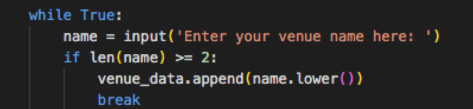

<h1>Late Gigs</h1>

[Live project:](https://late-gigs.herokuapp.com/)

Late Gigs is an online, 'last-minute' booking service for live music in the North East of Ireland.

Recently, almost every live music venue and act across
the region has been affected by a sudden gig cancellation due to the ongoing Covid pandemic.

This command line application has been designed to help venues and artists create gigs as quickly and efficiently as possible by firstly, searching through a database of available acts and venues to find a suitable match. If no match is found, Late Gigs will store the users information on a Google Spreadsheet then automatically create a gig for the user if a match is found. 

Users can also remove themselves from either of the Google-Sheet waiting lists if they secure an eleventh hour gig by another means.

Utilising Google's Gmail API, Late Gigs notifies both venues and acts on either of the waiting lists by email when a match is made and a gig is created. They are then automatically removed from the waiting lists and placed on a list of confirmed gigs.

## Contents
[Planning & Development](https://github.com/)

[Features](https://github.com/)

[Testing](https://github.com/)

[Deployment](https://github.com/)

[Languages](https://github.com/)

[Software](https://github.com/)

[Media](https://github.com/)

[Credits](https://github.com/)

## Planning & Development

- __Business Strategy__

     Late Gigs was born out of my own personal frustration surrounding the manifold increase in booking cancellations throught the local (North East) live music scene. 
 
     As a semi-retired musician, who gigs infrequently, covering cancellations ect, I recently noticed a huge upsurge in the number of venues contacting me to cover a night due to a Covid related gig cancellation. (examples below)  
     
     _Screenshots from my phone of venues requesting last-minute gigs._
     
      
    
     So like all budding developers I thought I'd have a go at automating a solution and Late Gigs is the result.
     
     Focusing on functionality, and a user friendly approach, Late Gigs aims to provide its specified target audience with a simple to use, effective and  essential resource. 
     
- __Target Audience__

    Late Gigs aims to provide a wide range of venues and acts across the North East of Ireland with an efficient means of covering late gig cancellations. 

    _Late Gigs Catchment Area -- The North East._
    
    I conducted a number of interviews with venues and acts to determine the best way to automate a solution to the problem of late cancellations.

    Venues canvassed: 
    
    * Malones of Kingscourt -- Aisling Malone
    * Willows of Kingscourt. -- Willie Owens
    * The Kelltic of Kells -- Paul Duffy

     

    Performers interviewed:

    * Andrew Grafton
    * Andrew Kelly
    * Liam Sheridan
    * Brian Harrison
    * Mark Montague
    * Shane McCabe

     

- __Targeting Key Demographics__

    The app's content and how it is displayed is informed by the outcomes of the research mentioned above.
    
    The Interviews determined that:
    
    1. Venues are affected by late cancellations the most and should be given priority as it is easier to find replacement bar staff than finding replacement musicians.
    2. Acts finding a venue is the most obvious secondary requirement.
    3. Both acts and venues should be able to continue to search for replacements alongside gig automation.
    4. Users should be able to remove themselves from the waiting list. 
    5. It is in the interest of all users to avoid double bookings.
    6. Users should find the app easy to use.
    
 

- __Target Audiences Summary__
    
    * Users who book acts for venues and are looking to book an act for a particular day of the coming weekend.

    * Users who are performers lloking to book an act for a particualar day of the coming weekend.

    * Users who have had a gig cancelled due to Covid.

    * Users who have had a gig cancelled due to another reason.

    * Users who are performers who gig infrequently... ;) .
    
    * Users who don't have time to manually search for gigs.

 

- __User Stories__

    * As a user, I want to find the most suitable act for my venue for this weekend.
 
    * As a User, I want to find the most suitable venue for my act for this weekend.
    
    * As a user, I want to increase my chances of creating a gig for the weekend.

    * As a user, I want to have a positive interaction with the app.
    
    * As a user, I want to find an act that suits my venue and budget.

    * As a user, I want to find an venue that suits my act and pays well.
    
    * As a user, I want to join a waiting list if I don't immediately find an act.

    * As a user, I want to join a waiting list if I don't immediately find a venue

    * As a user, I want to be notified by email when a gig is created for my venue or act.

    * As a user, I want to be notified of my progress when inputing my data.

    * As a user, I want to input my data incrementally, in case I make a mistake.

    * As a user, I want to change any mistakes I do make without having to run the app again.

 

- __Site Objectives__

    * To make Late Gigs a recognisable solution to an existing problem.
    
    * To make the purpose of the app obvious to the user.
    
    * To create gigs for people inconvienienced by late cancellations.

    * To provide users with the ability to join a waiting list.
    
    * To provide users with an easy to use interface.
    
    * To collect user data, including email addresses.
    
    * To automate booking gigs.

    * To increase the popularity of the app

    * To provide users with the ability to subscribe to a mailing list.

 

- __Approach__

    * The information will be provided to the user logically and informed by planning research.  

    * The app will be created following the principles of user experience design.

    * The app will collect user data in a the conversational style of a fun survey. 

    * The app will provide users with the contact information of users with matching requirements when a gig is created. 
    
    * The app will provide users with access to the database via PIN code to remove themselves from the database.

    * The app will be easy to navigate, intuitive and conversational.

    * The app will provide a section that explains how it works. 

     

_Basic structure of the app._

 - __Flowchart__ 

    The logic flow of the Late Gigs app is clearly explained in the following flowchart I created to use as a useful reference while developing the project. 

 

_Flow of logic from each of the menu functions._

  
    The final logic flow of the Late Gigs app doesn't deviate from this chart but there are some aspects of flow present in the current app that are missing from the original chart design. These include: passing user information through the "confirmed gigs" google sheet before creating a standby listing for the user (double booking check function). And also the removal of standby listings from the database once a gig is created.

 

# Features #

Below are some features the app currently has to offer and also some features which may be added in future.

## Existing Features ##

- __The Main Menu__

    * The Main Menu of the app appears when the app starts and offers the user the choice of four options. The options are displayed from top to bottom in order of their importance established during planning research. The app displays a welcome message to inform the user of its purpuse and simple to follow instructions on how to begin.

     

    _The Main Menu Screen of Late Gigs._

     

    * The Main Menu handles input errors by asking users to try again if they do not input one of the correct options.

     

- __The Area Check__

    * The Area Check feature ensures the user is aware of Late Gigs catchment area before proceding to either of the user surveys. 
    Executed through options one and two from the main menu, the area check feature could save users the time and inconvenience of filling out their details if they do not operate within the apps service area. 

     

    _The Area Check Screen of Late Gigs._

     

    * The feature establishes the users location by asking for a y/n
    response to the question "Is your venue/act in the North East?"

    * If the user responds no they are returned to the main menu, if they respond yes they are provided with a short survey depending on the type of user.

    * The Area check function handles errors by rejecting any inputs other than a y/n response and offering users the option to try again.

     

    * If the user responds yes then the Area Check function calls the function that executes the survey feature depending on the established user type.

    _Area Check Error Message._

     

    __User Data Survey__

    * When first considering my build approach to Late Gigs I wanted to make sure that whenever a user had to enter information about a particular venue or act the user experience should be easy and enjoyable and any instructions given to the user in the terminal should be upbeat and conversational as well as informative and reassuring. 

    * So rather than have users input each piece of data all at once using Comma Seperated Values (Venue, Rock, 350, ect...), I opted to use an informal survey instead. 

    * While this method might take slightly longer to complete, I feel that it provides the user with a much more positive experience and also allows ample opportunity to correct input errors along the way.

    * Another benefit of using a multiple input survey, is that it allows the app to collect different data types at the point of entry. Not only will this be useful later when manipulating number data, it will act as a foolproof method for guaranteing each entry has the correct data type at each point of the index of any given data list, preventing possible TypeErrors when the program searches each entry in the relevant gspread database.

    * Informed by planning research, the six data points collected from each user survey are:

    Name, Genre, Day, Fee, Members, Set Length
    
     

    _venues_in_sheet._

    _acts_in_sheet._

     

    * Name

    The users name is collected first. The name input accepts any data type but refuses to accept names of less than two characters. 

    This is to prevent users from firstly, accidently pressing return and entering no name but also to prevent the possibility of IndexErrors when accessing the database later. 

     

    _Name Screen._

     

    _Name Screen_Error Handling_

     

    * Genre

    The preferred genre is collected next. The genre input accepts any input from the provided list. The genre input will accept capitalised, upper and lower cased versions of these options but will return an error message prompting the user to try again after every incorrect attempt.  

    This is to guarantee the user inputs a valid genre 

     

    _Genre Screen._

     

    * Day

    The preferred day is collected next. The day input accepts any input from the provided list. The day input will accept capitalised, upper and lower cased versions of these options but will return an error message prompting the user to try again after every incorrect attempt.  

    This is to guarantee the user inputs a valid day 

     

    _Day Screen._

     

    * User Progress Prompt

    To enhance user experience, I included a breakpoint here that provides visual written feedback to the user about the data points entered so far. This is to make it easier for the user to correct a mistake early in the process. The user is prompted to continue by answering a y/n question.

     

    _Progress Screen._

     

 

    
    

    