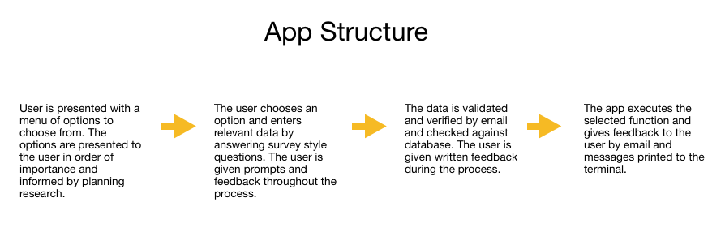

<h1>Late Gigs</h1>

[Live project:](https://late-gigs.herokuapp.com/)

Late Gigs is an online, 'last-minute' booking service for live music in the North East of Ireland.

 

Recently, almost every live music venue and act across
the region has been affected by a sudden gig cancellation due to the ongoing Covid pandemic.

This command line application has been designed to help venues and artists create gigs as quickly and efficiently as possible by firstly, searching through a database of available acts and venues to find a suitable match. If no match is found, Late Gigs will store the users information on a Google Spreadsheet then automatically create a gig for the user if a match is found. 

Users can also remove themselves from either of the Google-Sheet waiting lists if they secure an eleventh hour gig by another means.

Utilising Google's Gmail API, Late Gigs notifies both venues and acts on either of the waiting lists by email when a match is made and a gig is created. They are then automatically removed from the waiting lists and placed on a list of confirmed gigs.

 

## Contents
[Planning & Development](https://github.com/davidcalikes/Late-Gigs#planning--development)

[Features](https://github.com/davidcalikes/Late-Gigs#features)

[Testing](https://github.com/)

[Deployment](https://github.com/)

[Languages](https://github.com/)

[Software](https://github.com/)

[Media](https://github.com/)

[Credits](https://github.com/)

## Planning & Development

- __Business Strategy__

     Late Gigs was born out of my own personal frustration surrounding the manifold increase in booking cancellations throught the local (North East) live music scene. 
 
     As a semi-retired musician, who gigs infrequently, covering cancellations ect, I recently noticed a huge upsurge in the number of venues contacting me to cover a night due to a Covid related gig cancellation. (examples below)  
     
      _Screenshots from my phone of venues requesting last-minute gigs._
     
      
    
     So like all aspiring developers I thought I'd have a go at automating a solution and Late Gigs is the outcome.
     
     Focusing on functionality, and a user friendly approach, Late Gigs aims to provide its specified target audience with a simple to use, effective and  essential resource.

      

      _Late Gig Request During Development._

       

     As I began to develop the app I continued to recieve daily gig requests for short notice bookings. I feel this further stregthend an already robust business case.
     
- __Target Audience__

    Late Gigs aims to provide a wide range of venues and acts across the North East of Ireland with an efficient means of covering late gig cancellations. 

     _Late Gigs Catchment Area -- The North East._
    
    I conducted a number of interviews with venues and acts to determine the best way to automate a solution to the problem of late cancellations.

    Venues canvassed: 
    
    * Malones of Kingscourt -- Aisling Malone
    * Willows of Kingscourt. -- Willie Owens
    * The Kelltic of Kells -- Paul Duffy

     

    Performers interviewed:

    * Andrew Grafton
    * Andrew Kelly
    * Liam Sheridan
    * Brian Harrison
    * Mark Montague
    * Shane McCabe

     

- __Targeting Key Demographics__

    The app's content and how it is displayed is informed by the outcomes of the research mentioned above.
    
    The Interviews determined that:
    
    1. Venues are affected by late cancellations the most and should be given priority as it is easier to find replacement bar staff than finding replacement musicians.
    2. Acts finding a venue is the most obvious secondary requirement.
    3. Both acts and venues should be able to continue to search for replacements alongside gig automation.
    4. Users should be able to remove themselves from the waiting list. 
    5. It is in the interest of all users to avoid double bookings.
    6. Users should find the app easy to use.
    
 

- __Target Audiences Summary__
    
    * Users who book acts for venues and are looking to book an act for a particular day of the coming weekend.

    * Users who are performers loking to find a gig for a particualar day of the coming weekend.

    * Users who have had a gig cancelled due to Covid.

    * Users who have had a gig cancelled due to another reason.

    * Users who are performers who gig infrequently... ;) .
    
    * Users who don't have time to manually search for gigs.

 

- __User Stories__

    * As a user, I want to find the most suitable act for my venue for this weekend.
 
    * As a User, I want to find the most suitable venue for my act for this weekend.
    
    * As a user, I want to increase my chances of creating a gig for the weekend.

    * As a user, I want to have a positive interaction with the app.
    
    * As a user, I want to find an act that suits my venue and budget.

    * As a user, I want to find an venue that suits my act and pays well.
    
    * As a user, I want to join a waiting list if I don't immediately find an act.

    * As a user, I want to join a waiting list if I don't immediately find a venue

    * As a user, I want to be notified by email when a gig is created for my venue or act.

    * As a user, I want to be notified of my progress when inputing my data.

    * As a user, I want to input my data incrementally, in case I make a mistake.

    * As a user, I want to change any mistakes I do make without having to run the app again.

 

- __Site Objectives__

    * To make Late Gigs a recognisable solution to an existing problem.
    
    * To make the purpose of the app obvious to the user.
    
    * To create gigs for people inconvienienced by late cancellations.

    * To provide users with the ability to join a waiting list.
    
    * To provide users with an easy to use interface.
    
    * To collect user data, including email addresses.
    
    * To automate booking gigs.

    * To increase the popularity of the app.

    * To provide users with the ability to subscribe to a mailing list.

 

- __Approach__

    * The information will be provided to the user logically and informed by planning research.  

    * The app will be created following the principles of user experience design.

    * The app will collect user data in a the conversational style of a fun survey. 

    * The app will provide users with the contact information of users with matching requirements when a gig is created. 
    
    * The app will provide users with access to the database via PIN code to remove themselves from the database.

    * The app will be easy to navigate, intuitive and conversational.

    * The app will provide a section that explains how it works. 

     

 _Basic structure of the app._

 - __Flowchart__ 

    The logic flow of the Late Gigs app is clearly explained in the following flowchart I created to use as a useful reference while developing the project. 

 

 _Flow of logic from each of the menu functions._

  
    The final logic flow of the Late Gigs app doesn't deviate from this chart but there are some aspects of flow present in the current app that are missing from the original chart design. These include: passing user information through the "confirmed gigs" google sheet before creating a standby listing(double booking check function). And also the removal of standby listings from the database once a gig is created. This flow chart does not include the about feature.

 

# Features #

Below are some features the app currently has to offer and also some features which may be added in future.

## Existing Features ##

- __The Main Menu__

    * The Main Menu appears when the app starts and offers the user the choice of four options. The options are displayed from top to bottom in order of their importance established during planning research. The app displays a welcome message to inform the user of its purpuse and simple to follow instructions on how to begin.

     

     _The Main Menu Screen of Late Gigs._

     

    * The Main Menu handles input errors by asking users to try again if they do not input one of the correct options.

     

- __The Area Check__

    * The Area Check feature ensures the user is aware of Late Gigs catchment area before proceding to either of the user surveys. Executed through options one and two from the 'Main Menu', the area check feature could save users the time and inconvenience of filling out their details if they do not operate within the apps service area. 

     

     _The Area Check Screen of Late Gigs._

     

    * The feature establishes the users location by asking for a y/n
    response to the question "Is your venue/act in the North East?"

    * If the user responds no they are returned to the 'Main Menu' if they respond yes they are provided with a short survey depending on the type of user.

    * The Area check function handles errors by rejecting any inputs other than a y/n response and offering users the option to try again.

     

    * If the user responds yes then the Area Check function calls the function that executes the survey feature depending on the established user type.

     

     _Area Check Error Message._

     

    __User Data Survey__

    * When first considering my build approach to Late Gigs I wanted to make sure that whenever a user had to enter information about a particular venue or act the user experience should be easy and enjoyable and any instructions given to the user in the terminal should be upbeat and conversational as well as informative and reassuring. 

    * So rather than have users input each piece of data all at once using Comma Seperated Values (Venue, Rock, 350, ect...), I opted to use an informal survey instead. 

    * While this method might take slightly longer to complete, I feel that it provides the user with a much more positive experience and also allows ample opportunity to correct input errors along the way.

    * Another benefit of using a multiple input survey, is that it allows the app to collect different data types at the point of entry. Not only will this be useful later when manipulating number data, it will act as a foolproof method for guaranteing each entry has the correct data type at each point of the index of any given data list, preventing possible TypeErrors when the program searches each entry in the relevant gspread database.

    * Informed by planning research, the six data points collected from each user survey are: Name, Genre, Day, Fee, Members and Set Length.
    
     

     _Venues data points in data sheet._

     _Acts data points in data sheet._

     

* Name

    The users name is collected first. The name input accepts any data type but refuses to accept names of less than two characters. 

    This is to prevent users from entering no name at all, reducing the possibility of IndexErrors when accessing the database later. 

     

     _Name Screen._

     

* Genre

    The preferred genre is collected next, determining the preferred genre of music of the user. The genre input accepts any input from the provided list. The genre input will accept capitalised, upper and lower cased versions of these options but will return an error message prompting the user to try again after every incorrect attempt.  

    This is to guarantee the user inputs a valid genre. 

     

     _Genre Screen._

     

* Day

    The preferred day is collected next, determining which day the user wants Late Gigs to create a gig for. The day input accepts any input from the provided list. The day input will accept capitalised, upper and lower cased versions of these options but will return an error message prompting the user to try again after every incorrect attempt.  

    This is to guarantee the user inputs a valid day. 

     

     _Day Screen._

     

* User Progress Prompt

    To enhance user experience, I included a breakpoint here that provides visual written feedback to the user about the data points entered so far. This is to make it easier for the user to correct a mistake early in the process. The user is prompted to continue by answering a y/n question.

    The user progress prompt refuses to accept any other input and loops around until a selection is made.

     

     _Progress Screen._

     

* Fee

    The fee data point is collected next, determining the correct fee venues will pays acts for their services. The fee input accepts any input that is an integer within a specified range, returning an error message and prompting the user to retry if an invalid input is entered.   

    This is to ensure the user inputs an integer. 

     

     _Fee Screen._

     

* Members

    The members data point is collected next, determining how many members an act has or should have according to the users needs. The members input accepts any input that is an integer within a specified range, returning an error message and prompting the user to retry if an invalid input is entered.   

    This is to make sure the user inputs an integer. 

     

     _Members Screen._

     

* Set Length

    The set length data point is collected next, determining the length of an acts set or the length of set a venue requires. The set length input accepts any input that is an floating point number within a specified range, returning an error message and prompting the user to retry if an invalid input is entered.   

    This is to make sure the user inputs an floating point number. 

     

     _Set_length Screen._

     

* Pre Search Progress Prompt

    To enhance user experience, I included a second breakpoint here that provides visual written feedback to the user about the data points entered so far. This is to make it easier for the user to correct a mistake at this point in the process. The user is prompted to continue by answering a y/n question.

    The Pre Search progress prompt refuses to accept any other input and loops around until a valid selection is made.

     

     _Pre Search Check Screen._

     

* The Email Validation Screen

    The Email validation screen ensures that the user provides a valid email address in order to continue using the app.

    As detailed in the image below, this feature has several error handling functions including:
    
    * A regular expressions checker to validate the structure of email addresses submitted to the email input.

    * Error handling for the type and length of data that will be acceptable to the PIN input.

    * An optional code (0000) that allows the user to return to the 'Main Menu' if they have typed a structurally valid email address, but do not have access to the actual account to retrieve the code. 

     

     _Email Validation Screen._

     

- __Send Email Feature__
    
    When I started this project I set myself the challenge of incoporating email into the app as I thought it would best suit the practicalities of how I would inform users if a successful match is made.

    The Email Feature, powered by Google's Gmail API has two principle uses.

    1. To notify the user.
    2. To prevent misuse of the site.
    
    The user is notified by email whenever a successful match is made and a gig is created on the Google sheets database.

    The user is sent a unique pin number to help ensure no one can search the database without providing valid contact information first.

                       _Email Sent To User._

    The unique pin sent by email also prevents unauthorised users from removing gig listings maliciously.

    More details about the use of Email in Late Gigs can be found [here]

      

- __Check Lists Feature__
    
    * The Check Lists feature executes when the users email address is validated by a pin sent to the users email address.

     

     _Checking Venues List._

    * This feature loops through each entry on the list and returns the first match it finds.

    * In the interest of fairness, The Check Lists Feature allows Late Gigs to operate on a first-come first-served basis by starting the loop from the beginning of each waiting list. 

    * If no match is found a 'no matched' message is displayed to the user. The last function of this feature is to execute the 'Double Booking Check' feature.

    * If a match is made the last function of this feature is to execute the 'Create Gig' feature 

     

- __The Double Booking Check__
    
    * The Double Booking Check feature executes when there are no matches for an appropriate venue/act found during the running of the Check Lists Feature.

     

     _Scanning Gig List For Double Bookings._

     

    * This feature makes sure the user does not have an existing scheduled gig for the same day already on the 'gig_list' Google sheet, reducing the risk of a double booking.

    * If no gig list entry is found the venue or act is added to the appropriate waiting list to wait for a match over the coming days.

     _No Double Bookings Found._

     

     _Act Added To Standby List._
     
    * If a gig already exists for the user on the particular day specified the act or venue is not added to the database and the user is informed via written feedback.

    * At this point the app returns the user back to the 'Main Menu'.

     

- __The Create Gig Feature__
    
    * The Create Gig Function executes when the user responds yes to a found match. 

     

     _Match Found._

     

    * If the user types anything other than y or n the error handling loop returns a message prompting them to try again.

    * If the user selects y the create gig function begins by updating the Gig List sheet and removing the waiting list user from the waiting list sheet. The details of the gig are displayed to the user on screen.

     

     _Creating A Gig._

     

    * Both the active user and the waiting list user are then notified of the gig by email, which contains contact information and the gig details. Users are also encouraged to contact one another via email to discuss and confirm the booking.

    * A disclaimer is also included in each Email.

     

     _Notification Email._
     
    * The user is then returned to the 'Main Menu' after the gig is created.
    
     

     _Act Added To Standby List._
    
     

- __The Remove From List Feature__
    
    * The Remove From List Feature allows users to remove a waiting list item from the relevant list if they secure a late gig by another means.

    * This feature will only remove the listing if the user has a valid pin code that matches the user name who created it.

     

     _Questions And Error Handling._

     

    * The inputs of this feature all have working error handling as seen in the example above.

    * If the information the user submits matches data on either waiting list the entry is removed from the list.

     

     _Successful Removal._

     

    * If no matching data is found the user is given written feedback and is returned to the 'Main Menu'.

     

     _No Such Listing_
    
     

- __The About Feature__
    
    * The About Feature explains the purpose and functionality of Late Gigs to the user.

    * The About Feature is selected by choosing option 4 from the 'Main Menu'.

    * The user exits the About Feature by pressing any key.

     

- __The Clear Page Feature__
    
    * The Clear Page Feature removes messages, inputs and options no longer needed by the user.

    * The Clear Page Feature enhances the user experience by making it easier for the user to focus on relevant information.

     

- __Features Yet To Be Implemented__
    
    * To improve user experience, the first future feature I will impliment in the next iteration of Late Gigs is a better interface for the user to interact with.

    * I would also like to provide users with more flexibility regarding their data points, allowing for matches that are within a range of genres and have less or more than a set number of members etc. I purposely gave each data point a data type that will help facilitate this during the development of Late Gigs v2.0
    
    * In future versions of this app I would like to implement a priority scheme that would reward venues that provide Late Gigs with their IMRO registration number. I feel this would provide further security for the app and would eliminate the possibility of someone maliciously making bookings on behalf of venues.

    * The next logical step towards broadening the scope of future versions of the app would be to expand the catchment area of Late Gigs, offering the service to users from neighbouring counties.

    * In addition to the IMRO rewards scheme I think the app has huge potential to expand beyond it's scope of booking only last-minute bookings specifically and can be rescaled to schedule gigs for users throughout the year.

     

## Testing

  

- __Testing During Development__

     

    * During development I monitored the flow and logic of my code using print statements.

     

     _Use of Print Statement For Testing._
     

    * I also used print statements to help locate errors in my code as the code base grew and the flow became more complex.

     

     _Print Statement In Later Development_
     
    
    
    
    * During development I maintained the quality of my code using the built-in pylint validator extension in gitpod after completing a code block or whenever it showed an unusal amount of warnings.

     

     _Using Pylint Gitpod Extension_
     

 

- __Post Development Testing__

    * Peer Reviews

    Due to the nature of Late Gigs' automated email feature I decided that some of my Code Institute peers might not like the idea of using their personal Email accounts to test the app. So I ruled out submitting Late Gigs to the Peer Code Review channel on Slack. I did set up a test account (lategigs@gmail.com) for anyone who wants to use it, but I thought in the circumstances asking peers to log into a testing account was too much of an inconveinience so decided to ask a select group of collegues to give me feedback on using the app.

    * Richard Wells.

    Apart from myself, Richard was the first user of the deployed app and found a bug while inputing his email address.

    I explain the natur of this error and how I fixed the bug later in this section.

     

    * David Bowers.

        I asked fellow Code Institute Student David to check over Late Gigs for me and let me know if he found any issues.

         

     _Requesting Peer Review_
     

    I was delighted when David agreed to help review my code. 

    David found an issue with the y/n question inputs and kindly offered a solution.

     

     _Feedback From Peer_
     

    Somewhat disconcertingly, David did not find any other errors both as a user and within the code base.

    During his review David used Late Gigs to create a waiting list listing in the Google Sheets database.

     _Peer Listing_
    
    
     

    I used this information to create a matching act for David's venue running the program from option to on the 'Main Menu'.

    A gig was created and both users were informed via email.

    The gig was added to the gig list sheet and the venue was removed from the standby list.

    * Kasia Bogucka 

        I asked Kasia to provide some feedback specifically regarding her experience as a user of Late Gigs.

        Kasia was extremely positive about the app in general but found a rogue testing print statement that would not have been of any benefit to the user.

          

* PEP8 Onliine Validator
    
    * I submitted my code to the PEP8 online linter and the code shows no errors.

     

     _run.py_
     

     

     _mail.py_
    
     

* Bug Fixes

    * Email Input Bug

        During an online meeting with my Code Institute Mentor Richard Wells I found a bug that rejected valid user email addresses.

        The error was caused by the function used to validate the structure of an email address using regular expressions not validating users who included a period in the first part of the email address.

        This was solved by updating the Regex variable that contained the list of valid expressions.

     

    * Area Check Bug

        I also found another error that occured when a user tried to reply no to the 'Area Check' question.

     

     _Area Check Bug_
    
     

    This was caused by the lack of an elif condition in the function's while loop and was easily fixed.

     

     _Area Check Bug_

     

    * Index Error Bug

        I also found another bug that created an IndexError while the Double Booking Check feature searched through the Gig_list data sheet.

        This was caused by me accidently removing a cell from the Gig List.

    

 

    
    

    