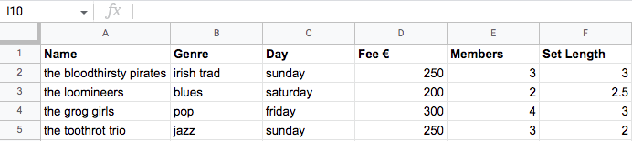
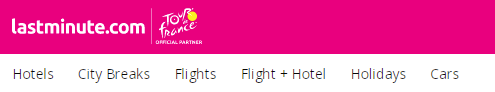
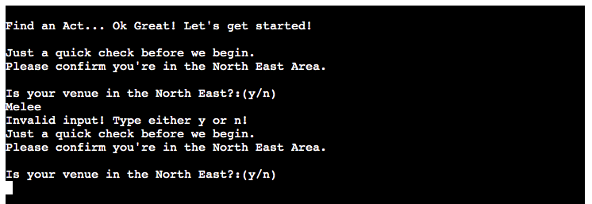
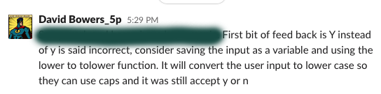

# Late Gigs
## Overview

Late Gigs is an online, 'last-minute' booking service for live music in the North East of Ireland.

 

Recently, almost every live music venue and act across
the region has been affected by a sudden gig cancellation due to the ongoing Covid pandemic.

The Late Gigs command line application has been designed to help venues and artists create gigs as quickly and efficiently as possible by firstly, searching through a database of available acts and venues to find a suitable match. If no match is found, Late Gigs will store the users information on a Google Spreadsheet then automatically create a gig for the user if a match is found in the following days. 

Users can also remove themselves from either of the Google Sheet waiting lists if they secure an eleventh hour gig by another means.

Utilising Google's Gmail API, Late Gigs notifies both venues and acts on either of the waiting lists by email when a match is made and a gig is created. They are then automatically removed from the waiting lists and placed on a list of confirmed gigs.

 

[Live project:](https://late-gigs.herokuapp.com/)

    
Original Google Sheets Data For Testing (Subject to change).
     

    
    

 _Sheet Names_
       
    
 _The Venues Waiting List_

 _The Acts Standby List_

 _The Confirmed Gigs List_

 _The User Details Database_
    
  
 

    
    

## Contents
[Planning & Development](https://github.com/davidcalikes/Late-Gigs#planning--development)

[Features](https://github.com/davidcalikes/Late-Gigs#features)

[Testing](https://github.com/davidcalikes/Late-Gigs#testing)

[Deployment](https://github.com/davidcalikes/Late-Gigs#deployment)

[Languages](https://github.com/davidcalikes/Late-Gigs#languages)

[Software](https://github.com/davidcalikes/Late-Gigs#software

[Credits](https://github.com/)

## Planning & Development

- __Business Case__

     Late Gigs was borne out of my own personal frustration surrounding the manifold increase in booking cancellations throughout the local (North East) live music scene. 
 
     As a semi-retired musician, who gigs infrequently, covering cancellations ect, I recently noticed a huge upsurge in the number of venues contacting me to cover a gig due to a Covid related cancellation. (examples below)  
     
      _Screenshots from my phone of venues requesting last-minute gigs._
     
      
    
    Like all aspiring developers, I thought it might be a good idea to have a go at automating a workable solution and Late Gigs is the result.
     
     Focusing on functionality, and a user friendly approach, Late Gigs aims to provide its specified target audience with a simple to use, effective and  essential resource.

* Similar Examples
     
     Whilst the business models may differ significantly, Late Gigs was nontheless inspired by other successful 'eleventh hour' online enterprises. (Examples Below)

      

      _Lastminute.com._

       

      

      _Late Rooms.com._

       

      

     As I began to develop the app I continued to receive daily gig requests for short notice bookings. I feel this further strengthened an already robust business case.
      

      _Late Gig Request During Development._

       

- __Target Audience__

    Late Gigs aims to provide a wide range of venues and acts across the North East of Ireland with an efficient means of covering late gig cancellations. 

     _Late Gigs Catchment Area -- The North East._
    
    I conducted a number of interviews with venues and acts to determine the best way to automate a solution to the problem of late cancellations.

    Venues canvassed: 
    
    * Malones of Kingscourt -- Aisling Malone
    * Willows of Kingscourt. -- Willie Owens
    * The Kelltic of Kells -- Paul Duffy

     

    Performers interviewed:

    * Andrew Grafton
    * Andrew Kelly
    * Liam Sheridan
    * Brian Harrison
    * Mark Montague
    * Shane McCabe

     

- __Research Conclusions__

    The app's content and how it is displayed is informed by the outcomes of the research mentioned above.
    
    The Interviews determined that:
    
    * Venues are affected by late cancellations the most and should be given priority as it is easier to find replacement bar staff than finding replacement musicians.

    * Acts finding a venue is the most obvious secondary requirement.

    * Both acts and venues should be able to continue to search for replacements alongside gig automation.

    * Users should be able to remove themselves from the waiting list. 

    * It is in the interest of all users to avoid double bookings.

    * Users should find the app easy to use.
    
 

- __Target Audiences Summary__
    
    * Users who book acts for venues and are looking to book an act for a particular day of the coming weekend.

    * Users who are performers loking to find a gig for a particualar day of the coming weekend.

    * Users who have had a gig cancelled due to Covid.

    * Users who have had a gig cancelled due to another reason.

    * Users who are performers who gig infrequently... ;) .
    
    * Users who don't have time to manually search for gigs.

 

- __User Stories__

    * As a user, I want to find the most suitable act for my venue for this weekend.
 
    * As a User, I want to find the most suitable venue for my act for this weekend.
    
    * As a user, I want to increase my chances of creating a gig for the weekend.

    * As a user, I want to have a positive interaction with the app.
    
    * As a user, I want to find an act that suits my venue and budget.

    * As a user, I want to find an venue that suits my act and pays well.
    
    * As a user, I want to join a waiting list if I don't immediately find an act.

    * As a user, I want to join a waiting list if I don't immediately find a venue

    * As a user, I want to be notified by email when a gig is created for my venue or act.

    * As a user, I want to be notified of my progress when inputing my data.

    * As a user, I want to input my data incrementally, in case I make a mistake.

    * As a user, I want to change any mistakes I do make without having to run the app again.

 

- __Site Objectives__

    * To make Late Gigs a recognisable solution to an existing problem.
    
    * To make the purpose of the app obvious to the user.
    
    * To create gigs for people inconvienienced by late cancellations.

    * To provide users with the ability to join a waiting list.
    
    * To provide users with an easy to use interface.
    
    * To collect user data, including email addresses.
    
    * To automate booking gigs.

    * To increase the popularity of the app.

 

- __Approach__

    * The information will be provided to the user logically and informed by planning research.  

    * The app will be created following the principles of user experience design.

    * The app will collect user data in a the conversational style of a light-hearted survey. 

    * The app will provide each user type with the contact information of the user with matching requirements when a gig is created. 
    
    * The app will provide users with access to the database via PIN code to remove themselves from the database.

    * The app will be easy to navigate, intuitive and conversational.

    * The app will provide a section that explains how it works. 

     

 _Basic structure of the app._

  

 - __Flowchart__ 

    The logic flow of the Late Gigs app is clearly explained in the following flowchart I created to use as a useful reference while developing the project. The Flowchart displays how the Late Gigs project as a whole embraces the principles of the CRUD functionality cycle. 

 

 _Flow of logic from each of the menu functions._

  
    The final logic flow of the Late Gigs app doesn't deviate from this chart but there are some aspects of logic flow present in the current app that are missing from the original chart's design. For example: passing the users information through the "confirmed gigs" Google sheet before creating a standby listing(double booking check function). And also the removal of a users standby listings from the database once a gig is created. This flow chart does not include the 'About' feature.

 

# Features #

Below are some features the app currently has to offer and also some features which may be added in future.

## Existing Features ##

- __The Main Menu__

    * The Main Menu appears when the app starts and offers the user the choice of four options. The options are displayed from top to bottom in order of their importance established during planning research. The app displays a welcome message to inform the user of its purpuse and simple to follow instructions on how to begin.

     

     _The Main Menu Screen of Late Gigs._

     

    * The Main Menu handles input errors by asking users to try again if they do not input one of the correct options.

     

- __The Area Check__

    * The Area Check feature ensures the user is aware of Late Gigs catchment area before proceeding to either of the user surveys. Executed through options one and two from the 'Main Menu', the area check feature could save users the time and inconvenience of filling out details if they do not operate within the apps service area. 

     

     _The Area Check Screen of Late Gigs._

     

    * The feature establishes the users location by asking for a y/n
    response to the question "Is your venue/act in the North East?"

    * If the user responds no they are returned to the 'Main Menu' if they respond yes they are provided with a short survey depending on the type of user.

    * The Area check function handles errors by rejecting any inputs other than a y/n response and offering users the option to try again.

     

    * If the user responds yes then the Area Check function calls the function that executes the survey feature depending on the established user type.

     

     _Area Check Error Message._

     

    __User Data Survey__

    * When first considering my build approach to Late Gigs I wanted to make sure that whenever a user had to enter information about a particular venue or act the user experience should be easy and enjoyable and any instructions given to the user in the terminal should be upbeat and conversational as well as informative and reassuring. 

    * So rather than have users input each piece of data all at once using Comma Seperated Values (Venue, Rock, 350, ect...), I opted to use an informal survey instead. 

    * While this method might take slightly longer to complete, I feel that it provides the user with a much more positive experience and also allows ample opportunity to correct input errors along the way.

    * Another benefit of using a multiple input survey, is that it allows the app to collect different data types at the point of entry. Not only will this be useful later when manipulating number data, it will act as a foolproof method for guaranteing each entry has the correct data type at each point of the index of any given data list, preventing possible TypeErrors when the program searches each entry in the relevant gspread database.

    * Informed by planning research, the six data points collected from each user survey are: Name, Genre, Day, Fee, Members and Set Length.
    
     

     _Venues data points in data sheet._

     _Acts data points in data sheet._

     

* Name

    The users name is collected first. The name input accepts any data type but refuses to accept names of less than two characters. 

    This is to prevent users from entering no name at all, reducing the possibility of IndexErrors when accessing the database later. 

     

     _Name Screen._

     

* Genre

    The preferred genre is collected next, determining the preferred genre of music of the user. The genre input accepts any input from the provided list. The genre input will accept capitalised, upper and lower cased versions of these options but will return an error message prompting the user to try again after every incorrect attempt.  

    This is to guarantee the user inputs a valid genre. 

     

     _Genre Screen._

     

* Day

    The preferred day is collected next, determining which day the user wants Late Gigs to create a gig for. The day input accepts any input from the provided list. The day input will accept capitalised, upper and lower cased versions of these options but will return an error message prompting the user to try again after every incorrect attempt.  

    This is to guarantee the user inputs a valid day. 

     

     _Day Screen._

     

* User Progress Prompt

    To enhance user experience, I included a breakpoint here that provides visual written feedback to the user about the data points entered so far. This is to make it easier for the user to correct a mistake early in the process. The user is prompted to continue by answering a y/n question.

    The user progress prompt refuses to accept any other input and loops around until a selection is made.

     

     _Progress Screen._

     

* Fee

    The fee data point is collected next, determining the correct fee venues will pays acts for their services. The fee input accepts any input that is an integer within a specified range, returning an error message and prompting the user to retry if an invalid input is entered.   

    This is to ensure the user inputs an integer. 

     

     _Fee Screen._

     

* Members

    The members data point is collected next, determining how many members an act has or should have according to the users needs. The members input accepts any input that is an integer within a specified range, returning an error message and prompting the user to retry if an invalid input is entered.   

    This is to make sure the user inputs an integer. 

     

     _Members Screen._

     

* Set Length

    The set length data point is collected next, determining the length of an acts set or the length of set a venue requires. The set length input accepts any input that is an floating point number within a specified range, returning an error message and prompting the user to retry if an invalid input is entered.   

    This is to make sure the user inputs an floating point number. 

     

     _Set length Screen._

     

* Pre Search Progress Prompt

    To enhance user experience, I included a second breakpoint here that provides visual written feedback to the user about the data points entered so far. This is to make it easier for the user to correct a mistake at this point in the process. The user is prompted to continue by answering a y/n question.

    The Pre Search progress prompt refuses to accept any other input and loops around until a valid selection is made.

     

     _Pre Search Check Screen._

     

* The Email Validation Screen

    The Email validation screen ensures that the user provides a valid email address in order to continue using the app.

    As detailed in the image below, this feature has several error handling functions including:
    
    * A regular expressions checker to validate the structure of email addresses submitted to the email input.

    * Error handling for the type and length of data that will be acceptable to the PIN input.

    * An optional code (0000) that allows the user to return to the 'Main Menu' if they have typed a structurally valid email address, but do not have access to the actual account to retrieve the code. 

     

     _Email Validation Screen._

     

- __Send Email Feature__
    
    When I started this project I set myself the challenge of incoporating email into the app as I thought it would best suit the practicalities of how I would inform users if a successful match is made.

    The Email Feature, powered by Google's Gmail API has two principle uses.

    * To notify the user.

     

    * To prevent misuse of the site.
    
    The user is notified by email whenever a successful match is made and a gig is created on the Google sheets database.

    The user is sent a unique pin number to help ensure no one can search the database without providing valid contact information first.

                       _Email Sent To User._

    The unique pin sent by email also prevents unauthorised users from removing gig listings maliciously.

      

- __Check Lists Feature__
    
    * The Check Lists feature executes when the users email address is validated by a pin sent to the users email address.

     

     _Checking Venues List._

    * This feature loops through each entry on the list and returns the first match it finds.

    * In the interest of fairness, The Check Lists Feature allows Late Gigs to operate on a first-come first-served basis by starting the loop from the beginning of each waiting list. 

    * If no match is found a 'no matched' message is displayed to the user. The last function of this feature is to execute the 'Double Booking Check' feature.

    * If a match is made the last function of this feature is to execute the 'Create Gig' feature 

     

- __The Double Booking Check__
    
    * The Double Booking Check feature executes when there are no matches for an appropriate venue/act found during the running of the Check Lists Feature.

     

     _Scanning Gig List For Double Bookings._

     

    * This feature makes sure the user does not have an existing scheduled gig for the same day already on the 'gig_list' Google sheet, reducing the risk of a double booking.

    * If no gig list entry is found the venue or act is added to the appropriate waiting list to wait for a match over the coming days.

     _No Double Bookings Found._

     

     _Act Added To Standby List._
     
    * If a gig already exists for the user on the particular day specified the act or venue is not added to the database and the user is informed via written feedback.

    * At this point the app returns the user back to the 'Main Menu'.

     

- __The Create Gig Feature__
    
    * The Create Gig Function executes when the user responds yes to a found match. 

     

     _Match Found._

     

    * If the user types anything other than y or n the error handling loop returns a message prompting them to try again.

    * If the user selects y the create gig function begins by updating the Gig List sheet and removing the waiting list user from the waiting list sheet. The details of the gig are displayed to the user on screen.

     

     _Creating A Gig._

     

    * Both the active user and the waiting list user are then notified of the gig by email, which contains contact information and the gig details. Users are also encouraged to contact one another via email to discuss and confirm the booking.

    * A disclaimer is also included in each Email.

     

     _Notification Email._
     
    * The user is then returned to the 'Main Menu' after the gig is created.
    
     

     _Act Added To Standby List._
    
     

- __The Remove From List Feature__
    
    * The Remove From List Feature allows users to remove a waiting list item from the relevant list if they secure a late gig by another means.

    * This feature will only remove the listing if the user has a valid pin code that matches the user name who created it.

     

     _Questions And Error Handling._

     

    * The inputs of this feature all have working error handling as seen in the example above.

    * If the information the user submits matches data on either waiting list the entry is removed from the list.

     

     _Successful Removal._

     

    * If no matching data is found the user is given written feedback and is returned to the 'Main Menu'.

     

     _No Such Listing_
    
     

- __The About Feature__
    
    * The About Feature explains the purpose and functionality of Late Gigs to the user.

    * The About Feature is selected by choosing option 4 from the 'Main Menu'.

    * The user exits the About Feature by pressing any key.

     

- __The Clear Page Feature__
    
    * The Clear Page Feature removes messages, inputs and options no longer needed by the user.

    * The Clear Page Feature enhances the user experience by making it easier for the user to focus on relevant information.

     

## Features Yet To Be Implemented

 
    
* To improve user experience, the first future feature I will impliment in the next iteration of Late Gigs is a better interface for the user to interact with.

* I would also like to provide users with more flexibility regarding their data points, allowing for matches that are within a range of genres and have less or more than a set number of members etc. I purposely gave each data point a data type that will help facilitate this during the development of Late Gigs v2.0

* The current version of Late Gigs requires the owner of the site to manually reset the database at the beginning of every week. In the future, I will automate this feature so that the Google Sheets are cleared for a new week. I would also like to collect the data from previous weeks to establish patterns of user behaviour accross time. This could prove useful to Venues and acts and could be a way to begin monetising the site.

* I would also like to include the option of monetising the site by offering users a way to gain a higher priority listing for a small fee.

* In future versions of this app I would like to implement a priority scheme that would reward venues that provide Late Gigs with their IMRO registration number. I feel this would provide further security for the app and would eliminate the possibility of someone maliciously making bookings on behalf of venues.

* The next logical step towards broadening the scope of future versions of the app would be to expand the catchment area of Late Gigs, offering the service to users from neighbouring counties.

* In addition to the IMRO rewards scheme I think the app has huge potential to expand beyond it's scope of booking only last-minute bookings specifically and can be rescaled to schedule gigs for users throughout the year.

     

## Testing

  

[Testing During Development]()

 

* During development I monitored the flow and logic of my code using print statements.

 

 _Use of Print Statement For Testing._

 

* I also used print statements to help locate errors in my code as the code base grew and the flow became more complex.

 _Error In Later Development_

 _Print Statments To Find Cause Of Error In Later Development_

 

*  Using Pylint

    During development I maintained the quality of my code using the built-in Pylint validator extension in gitpod after completing a code block or whenever it showed an unusal amount of warnings.

 

 _Using Pylint Gitpod Extension_
 

 

[Post Development Testing]()

* Peer Reviews

    Because of the automated email feature within the app I decided that some of my Code Institute peers might not like the idea of using their personal email accounts to test it, so I ruled out submitting Late Gigs to the CI Peer Code Review channel on Slack. I did set up a test account (lategigs@gmail.com) for anyone who wants to use it, but I thought in the circumstances asking peers to log into a testing account was too much of an inconvenience so decided instead to ask a select group of collegues to give me feedback on using the app.

     

    * Richard Wells.

        Apart from myself, Richard was the first user of the deployed app and found a bug while submitting his email address.

        I explain the nature of this error and how I fixed the bug later in this section.

     

    * David Bowers.

        I asked fellow Code Institute Student David Bowers to check over Late Gigs for me and let me know if he found any issues.

         

     _Requesting Peer Review_
     

    I was delighted when David agreed to help review my code. 

    David found an issue with the y/n question inputs and kindly offered a solution.

     

     _Feedback From Peer_
     

    Somewhat disconcertingly, David did not find any other errors, as a user or within the code base.

    During his review David used Late Gigs to create a waiting list listing in the Google Sheets database.

     _Peer Listing_
    
    
     

    I used this information to create a matching act for David's venue running the program from option two on the 'Main Menu'.

    A gig was created and both users were informed via email.

    The gig was added to the gig list sheet and the venue was removed from the standby list.

     

    * Kasia Bogucka 

        I asked Kasia to provide some feedback specifically regarding her experience as a user of Late Gigs.

        Kasia was extremely positive about the app in general but found a rogue print statement I used during the testing process that would not have been of any benefit to the user. (Thanks Kasia!)

          

* PEP8 Onliine Validator
    
    * I pasted my code into the PEP8 online validator and the code shows no errors.

     

     _run.py_
     

     

     _mail.py_
    
     

* Found Bugs and Fixes

    * Email Input Bug

        During an online meeting with my Code Institute Mentor Richard Wells I found a bug that rejected valid user email addresses.

        The error was caused by the function used to validate the structure of an email address using regular expressions. The email addresss that Richard submitted included a period in the first part of the email address.

        This issue was resolved by updating the Regex variable that contained the list of valid expressions.

     

    * Area Check Bug

        I also found another error that occured when a user tried to reply no to the 'Area Check' question.

     

     _Area Check Bug_
    
     

    This was caused by the lack of an elif condition in the function's while loop and was easily fixed.

     

     _Area Check Bug_

     

    * Index Error Bug

        I also found another bug that created an IndexError while the Double Booking Check feature searched through the Gig_list data sheet.

        This was caused by me accidently removing a cell from the Gig List.

         

* Other Known Bugs 

    There are currently no other known bugs but I will leave this section within the README document for any bugs that appear as the app continues to develop.

     

## Manual Testing

I created a test sequence to comprehensively check for errors and bugs in the Late Gigs app.

 

    

        The Manual Testing Sequence is extensive so I contained it here.
    

 

## Testing the program from the ‘Find an Act’ option of the Main Menu

 

I pressed 1 and enter to use the feature.

I then pressed no in response to the question: “Is your venue in the North East area” and was returned to the main menu.

I pressed 1 again.

I then typed a number  and was given an error message and asked to type option again by the program.

I typed y.

I was then asked to enter a venue name

I typed 0

The program returned an error message saying invalid name and that venue names must have more than two characters. And gave me the option to try again.

I typed a valid name of more than two characters.

I received a pleasing, conversational-style message asking me too choose from the list of genre’s
displayed

I entered number 4.

I received a message telling me that this was not a valid genre and to type again.

I entered ska

I the same error message again.

This time I entered the valid genre of jazz

I received another pleasing message, this time containing the two pieces of data already collected and asking me to type the required day of the coming weekend I need an act for my venue.

I typed 397

I received an error message telling me that 397 is not a valid gig day and was promoted to retry.

I typed Friday

I was provided with the information Late Gigs had collected so far and asked if I was happy to continue?

I typed number 376

I was told this was not a valid choice and typed n

I was given another choice of y to restart or n to exit.

I typed 300

I was told this was not a valid choice and asked if I was happy to continue

I was given another choice of y/n

I typed n

I confirmed I wanted to exit by pressing n again

I was returned to the main menu.

I started the sequence and inputed the data again up until the choice to continue

My choices were “TEST, Rock and Friday”

When asked if I was happy with these choices I selected y

I was asked to submit a fee

I typed the word “fifty”

I was then prompted to type a number

I typed the number 12

I was told that this was outside the apps recommended range and to try again.

I typed the number 4000 and got the same message

I then tried 600 which was acceptable.

I was then prompted for a maximum number of performers required.

I followed the same pattern as above to test the input. Typing a word then 0 then 50

I settled on 4 act members

I was then asked to Input a number between 1 and 5

I tested the range parameters and responded to the error messages above.

In this case, where a floating point number seemed to be allowed I tried to use the number 2.2

It was not accepted and I was asked to try again.

I entered 1.5

I was then presented with the values I had entered.

And was asked to if I would like to search the database for a new act.

I made a note of my values and pressed n

I was warned that my data would be lost if I chose to proceed and gave me the option to reconsider or quit to menu

I quit to menu and it brought me back to the menu page.

I re inserted my data and pressed y

I was asked to submit a valid email address
I typed: monkey bananas

I received a message informing me that this was not a valid email address and try again

I typed: 98713409871

Error try again!

I typed email@mailcom

Error try again!

I typed email, email.com

Error try again!

I then typed a valid email address that the REGEX function would accept but 
would be so ridiculous it probably wouldn’t have a destination: 

celticandrangersarefriends@sfa.co.uk

The email was accepted as valid

The program is now requesting a pin code that was sent to that email address.

I don’t have the code and now have to restart the program

But before I did I entered an email address into the pin field

And received a ValueError at line 492. [First Bug]

I restarted the program with the same values

TEST ROCK FRIDAY 600 4 1.5

This time I sent the email to the testing gmail account I had set up lategigs@gmail.com

And tried to recreate the Value error but it was successfully caught this time by an except I implemented to catch it!

I checked my  testing email account to find I had received a pin from lategigs.

I entered the pin

The program checked the database for a matching act but could not find one so added me to the standby list database.

I checked the database and the listing was created and all values were correct.

 

# Testing the program from ‘the Find an Act’ option.

I repeated the steps above to add a non-matching act to the database.

I found the following errors:

I pressed no in response to the question asking if I was in the north east and was not returned directly to the main menu. I fixed this by adding an elif condition to the area_check function.
I can now confidently add new venues and acts to the waiting list without errors

During this stage of  testing I realised that users had no way of returning to the main menu if there was an issue with receiving and inputing a pin so I provided a condition to the function loop that would allow the user to exit to menu by typing 0000 [UX Error]

Obviously there is an issue with this if the random number generator produces a pin that is 0000 but I figured at least in the short term that is highly unlikely. (1 in 10,000 chance)
I will try to find a more elegant solution, (max 3 attempts for example) during development of Late Gigs V2.0 

 

# Testing by creating a gig from the ‘Find a Venue’ option

Because I knew the properties of two entries on the waiting list I could now try and get the app to create a matching gig.

I first tried the find and act option using the details of the first venue

After entering my email address and PIN the program executed successfully and returned a match

It provided me with the option to create the gig by answering yes or no

I chose no

The program took me back to the main menu

I re inserted all of the data.

After entering my email address and PIN the program executed successfully and returned a match

It provided me with the option to create the gig by answering yes or no

I choose yes

The program successfully created a gig by adding the act and venue to the gig_list google sheet

And also removed the venue from the venues sheet.

Both the venue and the act were notified by email that a gig had been created.

The emails contained the correct gig information and means of contacting each other to arrange start times etc.

 

# Testing by creating a gig from the ‘Find an Act’ option

I used the same process above but started out from the find an act menu option.

The program found a match and asked if I wanted to create the gig

I chose no and was returned to the main menu

I re submitted the venue info and when I reached the same point this time I replied yes.

The program executed successfully and a gig was created.

The process  also removed the act from the standby sheet.

Both the venue and the act were notified by email that a gig had been created.

The emails contained the correct gig information and means of contacting each other to arrange start times etc.

The emails contained the gig information and means of contacting each other to arrange start times etc.

 

# Testing by attempting to cause a double booking.

Now that I had items in the database I wanted to try and test the feature that checks for double bookings.

I took the values of the last two successfully created gigs from the gig_list sheet and used them to
test the  double_booking_check functions

I first started by to trying to create a waiting list entry from the ‘find an act’ option.

The double_booking_check function caught the attempt at double booking and returned to the main menu without adding the venue to the waiting list.

I repeated the process from the ‘find a venue’ option.

The double_booking_check function caught the attempt at double booking and returned to the main menu without adding the act to the waiting list.

 

# Testing from the ‘Remove from list’ option. User type: Venue

Error checking:

I started the process by selecting option 3 from the main menu.

The screen then asked me to type either Venue or Act

I typed: Guybrush

The program displayed an invalid input message and asked me to try again.

I then typed: 2468

The same error appeared.

I then typed Venue

A screen appeared and asked me for the name of my venue.

I typed the the name of a venue I knew not to be on the  venue waiting list.

The program continued and asked for the day the booking was for… I answered

354

The program replied with “Invalid input try again!”

I then typed 

Sunday

The process the moved on to ask me for my unique pin number 

I entered Grog

The program responded by returning an error and stating that the pin should be a 4 digit number

I Typed 1

The program responded by returning an error and stating that the pin should be a 4 digit number

I typed 23456

The program responded by returning an error and stating that the pin should be a 4 digit number

I typed 1967 and the program accepted the pin

The program returned to the main menu displaying a message that no listing had been found that match the user details provided. 

I then checked the venues worksheet and typed the details of a venue I knew to be properly registered and on the list.

The process found the listing and removed the correct item from the venues database and returned to the main menu.

# Testing from the ‘Remove from list’ option. User type: Act

Error checking:

I repeated the exact process I used testing the option with the venue user type and returned zero errors.

The acts sheet was correctly amended and the user was returned to the main menu.

Testing the About Late gigs option.

I selected option 4 and was provided with details about how the app functions. 

There was user instructions saying press enter to get started

I typed a 435

and was taken back to the main menu.

I then typed: Stan

and was taken back to the main menu.

I pressed return

and was taken back to the main menu.

 

              

The results of sequence testing returned no further errors.

I used the testing sequence to vigorously check for errors using the following venues and acts.

Venue input data

| Name             | Genre      | Day      | Fee | Members | Set Length |
|------------------|------------|----------|-----|---------|------------|
| The Broken Clock | Irish Trad | Sunday   | 300 | 3       | 2.5        |
| The Scumm Bar    | Blues      | Saturday | 150 | 2       | 2          |
| The Big Tree     | Pop        | Friday   | 200 | 4       | 2          |
| The Bloody Lip   | Jazz       | Sunday   | 350 | 3       | 3          |

Act input data

| Name                     | Genre      | Day      | Fee | Members | Set Length |
|--------------------------|------------|----------|-----|---------|------------|
| The Bloodthirsty Pirates | Irish Trad | Sunday   | 300 | 3       | 2.5        |
| The Loomineers           | Blues      | Saturday | 150 | 2       | 2          |
| The Grog Girls           | Pop        | Friday   | 200 | 4       | 2          |
| The Toothrot Trio        | Jazz       | Sunday   | 350 | 3       | 3          |

Results

| Venue            | Name                     | Input Errors | Other Errors | Emails Sent/Received | 1st User |
|------------------|--------------------------|--------------|--------------|----------------------|----------|
| The Broken Clock | The Bloodthirsty Pirates | 1            | 1            | yes                  | venue    |
| The Scumm Bar    | The Loomineers           | 0            | 0            | yes                  | act      |
| The Big Tree     | The Grog Girls           | 0            | 0            | yes                  | venue    |
| The Bloody Lip   | The Toothrot Trio        | 0            | 0            | yes                  | act      |

NB I used different values to test the removal of two of each of the Venues and two of the Acts listings.

No errors were returned when testing the Remove Listing Feature.

 

Bugs found during manual testing:

 

 _Value Error Found During Test Sequence._
    
 

1. I discovered a value error that would cause a negative user experience at the user pin input during the first run of the sequence. I fixed this by adding an error handling feature that prompts the user to try again and gives them feedback about the entering a valid pin.

2. During this stage of  testing I realised that users had no way of returning to the main menu if there was an issue with receiving or submitting a valid PIN so I added an extra condition to the function loop that would allow the user to exit to the 'Main Menu' by typing '0000' [UX Error]

    Obviously there is an issue with this solution if the random number generator produces a pin that is 0000 but I figured at least in the short term that is highly unlikely. (1 in 10,000 chance) I will try to find a more elegant way of solving this problem, (max 3 attempts for example) during development of Late Gigs V2.0

 
 

# Deployment

### Cloning The 'Late Gigs' GitHub Repository

 

* Visit the repository:   https://github.com/davidcalikes/Late-Gigs
    
* Access the 'Code' menu from above the main directory window and choose a preffered cloning option by selecting either HTTPS or GitHub CLI. An SSH key is required should you prefer that option.

     

     Code Menu
    
     

* Press the overlapping squares icon to copy the link to the repository.

    

        
Open Git Bash and change the current working directory to your prefered directory.

     _[Credit: Stack Overflow](https://stackoverflow.com/questions/8961334/how-to-change-folder-with-git-bash.)_
    

     

* Use the "git clone" command and paste the URL of the Late Gigs repository.

* Press Enter to create the clone.

 

### Forking The 'Late Gigs' GitHub Repository

 

* Visit the repository:   https://github.com/davidcalikes/Late-Gigs

* Click on the 'Fork' option.

     

     _Forking Option_
        
     

### Enabling API's

  ###

  * Set up APIs using the Google Cloud Platform

      * Log in to Google Cloud :https://console.cloud.google.com
      
      * Set up a new project. 
      
      * Click the burger menu in the top left of the screen to access the sidebar menu.

      * From the sidebar menu click 'APIs and Services' and then 'Library'

       

     _Google Cloud Platform_
        
     

    * Search for Google Drive API.

    * Select Google Drive API and click on 'enable' to get to the API and Services Overview page. 
        
    * Click on the Create Credentials button near the top left of the screen.

     

     _Create Credentials_
        
     

     _Create Credentials Menu_
        
     

    * Fill out the 'Credential Type Form"
        
    * Create a 'Service Account' by entering an account name in the name field.
    
    * Click, 'Create and Continue'
    
    * Next, click 'Grant this service account access to project',  and select 'Basic' and then 'Editor' from the 'Select a Role' dropdown menu.

    *    _Just Click Done Here._
        
     
    
    * Click on the service account name in the Service Accounts section and to go to the configuration page for the new account.
    
    * Click the 'KEYS' tab at the top of the screen the click
    the 'Add Key' dropdown and select 'Create New Key.'
    
    * Click the 'JSON' button then 'Create'. Your new credentials file will now download into your default downloads folder,

    * The Late Gigs Credentials file is called creds.json. Rename your .json file to creds.json and ensure it is still listed in the .gitignore file.

    * Copy the creds file into the cloned repo.
    
    * Finally authorise access to the Google Spreadsheet linked to this project by pasting the "client email" part of the creds.json file into the "Add people and groups" field of the 'Share' option of the Google Drive's, Google Sheet page. 

    *    _The 'Share' Options Modal of A Google Sheet._

     

* Enable Google Sheets API 
        
     * Go back to the dashboard for the project on Google Cloud Platform and access the navigation menu as before
     
     * On the left hand menu select 'APIs and Services' and then 'Library'
     
     * Search for Google Sheets API
     
     * Select Google Sheets API and click on 'enable'

         

* Enable GMail API 
        
     * Go back to the dashboard for the project on Google Cloud Platform and access the 
     navigation menu as before
    
     * On the left hand menu select 'APIs and Services' and then 'Library'
    
     * Search for Gmail API
     
     * Select Gmail API and click on 'enable'

  * Install gspread and google-auth and gmail libraries using the command 'pip3 install gspread gmail google-auth'

  

* Authorise Gmail Via Domain Wide Delegation

    * Log in to to your Google Workspace account: If you do not have a workspace account you can sign up for a 14 day free trial [here.](https://workspace.google.com/business/signup/welcome?hl=en-IE&source=gafb-pricing-body-en-IE&ga_region=en_ie&ga_country=en_ie&ga_lang=en&sku=businessstarter&__utma=61317162.84784263.1657825154.1657905712.1658431340.4&__utmb=61317162.0.10.1658431369248&__utmc=61317162&__utmx=-&__utmz=61317162.1658431340.4.4.utmcsr=google|utmgclid=Cj0KCQjw8uOWBhDXARIsAOxKJ2GlAabBD2YKmgJqQ9uuvXuAqqftiInlFjHypjqYQUb392_BHwa1KnwaAupzEALw_wcB|utmgclsrc=aw.ds|utmccn=emea-ie-all-en-dr-bkws-all-all-trial-p-t1-1011339|utmcmd=cpc|utmctr=KW_google%20workspace%20account-g|utmcct=text-ad-none-none-DEV_c-CRE_554514867052-ADGP_Hybrid%20|%20BKWS%20-%20PHR%20|%20Txt%20~%20Google%20Workspace%20~%20Create_Account-KWID_43700067037915940-kwd-980680864686-userloc_20476&__utmv=-&__utmk=249278784)

    * Open up a Google [admin console](https://admin.google.com/) while signed in with your workspace account.

    * Click on the tab labelled 'Security' on the left hand side of the screen.

    * Click the 'API controls' tab from the 'Access and data controls' drop down 
    menu.

     

     _Google Admin_
        
     

    * At the bottom of the page click the 'Manage Domain Wide Delegation' tab.

    * Click on the 'Add a filter' tab

    * In the 'Client id' field copy and paste the Client Id from your creds.json file.

     

     _Client id_
        
     

     * In the 'Client id' field copy and paste the Client Id from your creds.json file.

    * In the 'Scopes' field copy and paste the following: https://mail.google.com/

     

* Create The Google Sheets Database

  * Create a Google Spreadsheet called 'late_gigs' on
    Google Drive with 4 sheets:
    * venues
    * standby
    * gig_list
    * user_details
    
     
    
    
* The sheets should look exactly like the examples below.

   

 _Sheet Names_
       
    
 _The Venues Waiting List_

 _The Acts Standby List_

 _The Confirmed Gigs List_

 _The User Details Database_

  * The data in these examples is not necessary for the app to function correctly, but incomplete rows may result in IndexErrors and values outside the following will result in ValueErrors:

  * Each user name must have more than two characters.

  * Each Genre must be on the list of approved genre's.

  * Valid gifg days are 'Friday' 'Saturday' and 'Sunday'.

  * Each Fee Value must be between 150 and 1000.

  * Acts must have at least one but no more than fifteen members.

  * Set lengths can be between 1 and 5 hours incremting in half hour intervals. (Written as 1, 1.5, 2. 2.5 etc.)

   

  ### Deploying Late Gigs To Heroku

  

* Access your Heroku account: https://id.heroku.com/login (Create a new account if required)

* Create a new app giving your app a unique name. 

* Click on the settings tab scrolling down to the 'Config Vars' section and set up the apps environment variables. Click on the option to reveal the config vars and type CREDS into the 'KEY' input. You will then have to paste the contents of the creds.json file into the input labelled 'VALUE'

* Add another config var this time enter 'PORT' in the 'KEY' field and '8000' in the 'VALUE' field.

* Next click 'Buildpacks' and add the 'Python' buildpack then the 'Node.js' bulid pack, strictly in that order.

* Select the 'Deploy' tab next and select GitHub as the deployment method.

* Enter the name of the repository in the search field provided and click 'Connect' to create a link between Heroku and the GitHub repository.

* Choose to either manually or automatically deploy the app. Applications deployed using the 'Automatic Deploy' option are automatically updated every time changes are pushed to github.

 

# Languages

* The coding language used to create this app was Python (v3.8.1.1)

     

* The Node.js backend runtime environment was incorporated via the Code Intitute's Python Student Template. 

 

# Software

* Gitpod to create, load and push my code to Github.

* Git, (Gitpod and Github) as my version control system for the site.
    
* Adobe Photoshop CS6 to edit my README images.

* Tables Generator to create my markdown testing tables.

 _Tables Generator_

* Lucidchart for the development of the app's Logic Flowchart.

* Google sheets to act as a database for the project

 

### API's

* Gspread to communicate with the database from a Python based development environment/app.

* Google Drive

* Google Sheets API: To store the user data.

* Gmail API: To send emails to the app's users

* Google Auth: Required to authenticate Google Creds and underpin the Domain Wide Delegation feature I used to authorised Gmail API. 

* Heroku: To deploy the app.

 

### Modules(Single Purpose Libraries)

 

* RE module: To Validate email inputs.

* OS module: To support the Clear_page feature/function.

* Random module: To support the Create PIN function.

 

# Credits

- __Content__

    Genreal referances:

    * https://stackoverflow.com/questions/45437216/how-do-i-generate-a-random-4-digit-number-and-store-it-as-a-variable-in-python

    * https://stackoverflow.com/questions/35488774/how-to-validate-an-input-with-a-4-digit-number

    * https://www.geeksforgeeks.org/multi-line-printing-in-python/

    * https://stackoverflow.com/questions/5557937/how-do-i-use-try-except-or-if-else-to-validate-user-input

    * https://stackoverflow.com/questions/2084508/clear-terminal-in-python

    Sheets:
    
    * https://www.youtube.com/watch?v=w1jrCxWx7Tc

    Email

    * https://www.youtube.com/watch?v=SpmWlHRVn9c

    * https://www.youtube.com/watch?v=44ERDGa9Dr4

    Markdown

    * https://github.com/elainebroche-dev/ms3-event-scheduler/blob/main/README.md

 

- __Thanks__

    * Michelle Calikes

        For the last couple of projects I have been so heavily focused on thanking the people surrounding me offering me technical advice I usaully leave thanking my beautiful wife Michelle until somewhere near the end of these credits. On this occasion that would be absolutley imposssible. Michelle looked after all of the important things in our home while I became lost in the Late Gigs project. Thank you Michelle, there are mo words to repay the sacrifices you have made that allowed me to give 100% to this project. 

    * Richard Wells 

        Again, Mr Wells continues to surpass himself as an inspirational mentor and collegue. Richard went above and beyond for me during this project and I won't forget his support.

    * David Bowers
    
       Thanks to David for reviewing my app. Thera are few people I would trust to give me authentic feedback but David is definitely one of them. 

    * The Research participants.

    Liam, Ash, Willie, Brian, the Andy's, Paul, Mark and Shane thanks for the feedback I thoroughly appreciate it!

    

 

    

 

    
    

    